  
# 𝗬𝗨𝗥𝗜
Backend developer · Java · Web systems

Academic projects, experiments, and things I'm learning.  
Still building. Still improving.

---

## ⚙ STACK

---

## 📊 ACTIVITY

  

 

 

---

## 📌 NOTES

Backend projects and university work  
Interested in system design, data processing, and maps  

More coming over time.

---

## 📫 CONTACT

[LinkedIn](https://linkedin.com/in/your-profile)  
your@email.com

